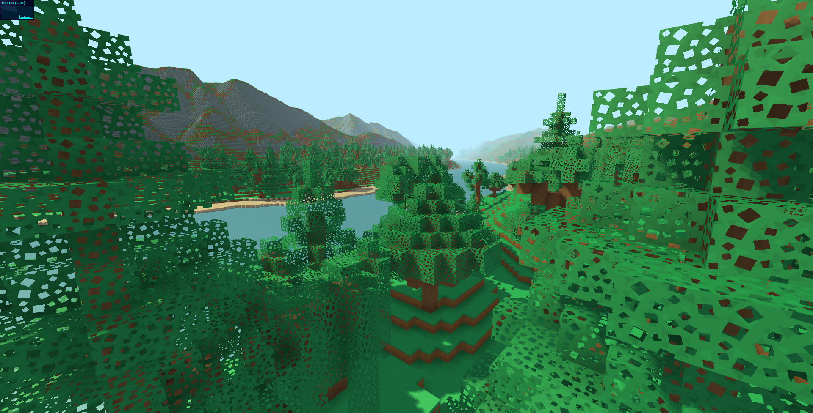

# Terrablox

A voxel engine I was working on a while back.
I left it for a while, then thought it was broke, started rewriting it, realized it wasn't broke...
So I tidied it up a bit a removed some of the stupid stuf I put in it before.
I'll continue to tidy it up and work on it some more.

Uses an older version of three.js, I'll have to gradually update a version at a time.
Newer version just don't render anything and I'm not sure why.

Try it out here: https://jackoatley.github.io/Terrablox/

# Running

Using npm, you can just do: npm test. All this does though is run http-server, so if you have that already you can just run that in the folder.
